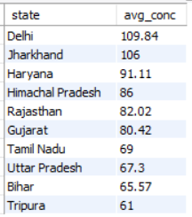
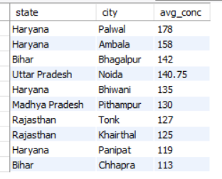

# India-Air-Pollution-Monitoring-Snapshot

### Project Overview

This project demonstrates & analyses the snapshot of India's air pollution monitoring recorded particularly on 24/08/2026 11:00:00 AM. The data consisted with pollutants like PM 2.5, PM10, NH3, SO2, NO2, OZONE, CO recorded across multiple stations and cities across states of India with its maximum, minimum and average metrics recorded, This project focuses on performing region specific analysis, missing records analysis & also analysis driven with respect to properties of pollutants.

### Tech Stack

**Python (Pandas)**: Used for initial data loading, basic data cleaning, missing value analysis, and preparing the dataset for further analysis.

**MySQL**: Used to store and analyze the air pollution dataset. SQL queries were used to perform state-wise pollutant analysis, identify maximum recorded pollutant concentrations, analyze monitoring coverage, and assess missing data.

**Power BI**: Used to build an interactive single-page dashboard for visualizing the overall air pollution monitoring snapshot, including state-wise PM2.5 concentrations, pollutant profiles, monitoring station coverage, and highest reported pollutant concentrations.

**DAX**: Used for basic calculations and measures required for KPI cards and dashboard analysis

### Insights & Recommendations

**1. States with Higher Average PM2.5**

**Insight**

- States like Delhi, Jharkhand, Haryana, Himachal Pradesh, Rajasthan recorded average pm 2.5 higher in comparison to other states which particularly drives attention to be given as PM 2.5 as a pollutant has properties which can penetrate deep into the lungs and potentially enter the bloodstream and have an effect people's health.

**Recommendation**

- These states having higher average PM2.5 concentration data recorded gets a basis for targeted investigation and control of major known contributing source categories.

**2. States with Higher Average PM10**

**Insight**

- States like Delhi, Jharkhand, Haryana, Himachal Pradesh, Rajasthan recorded higher average PM10 in comparison to other states and PM10 as a pollutant is commonly associated with dust generating sources such as road dust, traffic related dust resuspension, construction and demolition activities which can have an effect on people's respiratory health.
      

**Recommendation**

- These observed concentration in these states highlights the need to investigate and control of likely dust generating sources.

