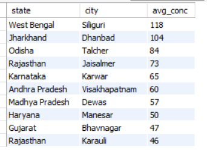
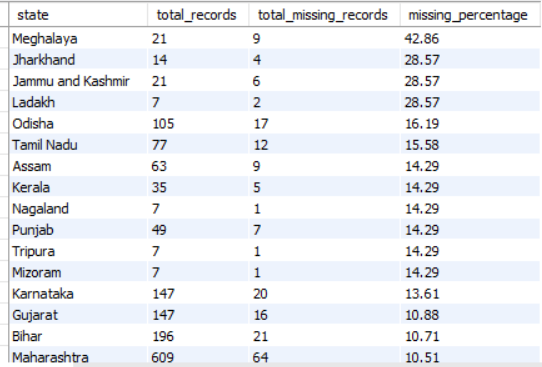
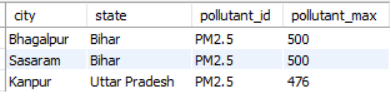
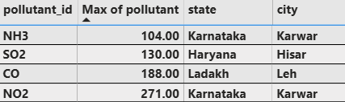
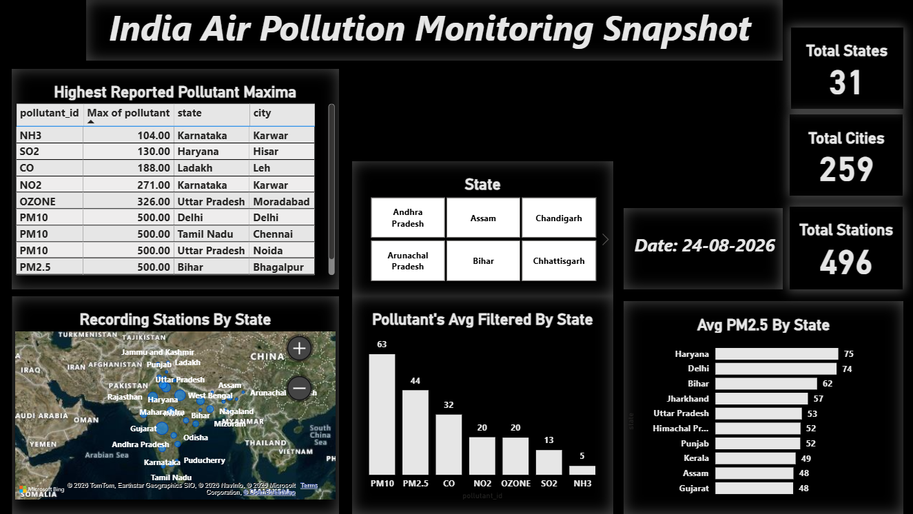

# India-Air-Pollution-Monitoring-Snapshot

### Project Overview

This project analyses a snapshot of India's air pollution monitoring data recorded on 24/08/2026 at 11:00 AM. The dataset contains pollutant measurements for PM2.5, PM10, NH3, SO2, NO2, OZONE and CO across monitoring stations and cities in different states of India, along with their minimum, maximum and average recorded values. The analysis focuses on region-specific pollution patterns, monitoring station distribution, missing records, pollutant-specific observations and identification of potential pollution hotspots.

### Tech Stack

**Python (Pandas)**: Used for initial data loading, basic data cleaning, missing value analysis, and preparing the dataset for further analysis.

**MySQL**: Used to store and analyze the air pollution dataset. SQL queries were used to perform state-wise pollutant analysis, identify maximum recorded pollutant concentrations, analyze monitoring coverage, and assess missing data.

**Power BI**: Used to build an interactive single-page dashboard for visualizing the overall air pollution monitoring snapshot, including state-wise PM2.5 concentrations, pollutant profiles, monitoring station coverage, and highest reported pollutant concentrations.

**DAX**: Used for basic calculations and measures required for KPI cards and dashboard analysis

### Insights & Recommendations

**1. Cities and their respective states with Higher Average PM2.5**

**Insight**

- Cities like Bhagalpur(Bihar), Faridabad(Haryana), Khora(Uttar Pradesh), Manesar(Haryana), Khairthal(Rajasthan) recorded average pm 2.5 higher in comparison to other cities which particularly drives attention to be given as PM 2.5 as a pollutant has properties which can penetrate deep into the lungs and potentially enter the bloodstream and have an effect people's health.
  
- Also out of the top cities having higher PM2.5 concentration major of them belonged to one state i.e Haryana which highlights paying attention with respect to it.

**Recommendation**

- These cities with their respective states having higher average PM2.5 concentration data recorded gets a basis for targeted investigation and control of major known contributing source categories.

**2. Cities and their respective States with Higher Average PM10**

**Insight**

- Cities like Palwal(Haryana), Ambala(Haryana), Bhagalpur(Bihar), Noida(Uttar Pradesh), Bhiwani(Haryana) recorded higher average PM10 in comparison to other cities and PM10 as a pollutant is commonly associated with dust generating sources such as road dust, traffic related dust resuspension, construction and demolition activities which can have an effect on people's respiratory health.
      

**Recommendation**

- These observed concentration in these cities and states highlights the need to investigate and control of likely dust generating sources.

**3. Cities and their respective States with Higher Average NO2**

**Insight**

- Cities like Siliguri(Bengal), Dhanbad(Jharkhand), Talcher(Odisha), Jaisalmer(Rajasthan) had higher concentration of NO2 recorded on average than other cities which is likely to be associated with urban traffic and combustion through vehicle emissions, traffic congestion, fuel combustion etc

**Recommendation**

- These locations recording higher average NO2 concentration should be prioritized for investigation of major combustion-related emission sources, particularly high-traffic corridors and nearby fuel combustion activities.

**4. State wise missing data records analysis**

**Insight**

- States like Meghalaya, Jharkhand, Jammu & Kashmir, Ladakh had missed recording data higher with 43%, 29%, 29%, 29% respectively which highlights an attention to be given as out of 100% data recorded if 30-40% records are missed recording it can leave a missing gap for data in those particular places.

**Recommendation**

- These states facing this issue with more missing records should check their monitoring stations and data collection systems to identify the reasons for these gaps and improve data availability.

**5. Cities with their respective States which Recorded Highest PM2.5**

**Insight**

- Cities like Bhagalpur(Bihar), Sasaram(Bihar), Kanpur(Uttar Pradesh) recorded highest spike of PM2.5 with 500, 500, 476 respectively which flags an attention with respect to the properties of the pollutant

- Bhagalpur(Bihar) flags an investigation as higher average concentration of PM2.5 was found there and the highest spike ok the pollutant was also recorded in the same city.
    

**Recommendation**

- Bhagalpur should be prioritized for further investigation, with authorities checking nearby traffic, construction, industrial activity and open-burning sources to identify possible contributors to the high PM2.5 levels.

**6. Spikes of Two Pollutants (NH3 & NO2) were recorded in the same location- Karwar(Karnataka)**

**Insight**

- Karwar(Karnataka) City itself recorded Peaks of NH3 & NO2 recorded with 104 & 271 respectively.

**Recommendation**

- Peaks of two pollutants getting recorded at the same city indicates that the city may warrant further investigation into local combustion and other potential emission sources.

### Dashboard

### Conclusion

This project provides a snapshot of India's air pollution monitoring landscape on 24 August 2026, highlighting regional pollutant patterns, potential hotspots and monitoring data gaps. As the analysis is based on a single time snapshot, the findings represent conditions recorded at that point and should not be interpreted as long-term pollution trends.
